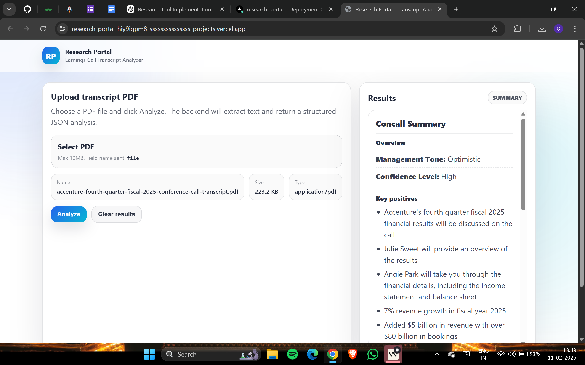

# Research Portal – Earnings Call Summary Tool

> **Option B – Structured Analyst Summaries from Earnings Call Transcripts**

---

## ⚠️ Important (Free Tier Notice)

This project is deployed using free-tier hosting (Render + Vercel).

Because of:
- Cold starts
- Free compute limits
- LLM rate limits

⏳ **Please wait up to 60 seconds after clicking “Analyze”.**

The system may take some time to:
1. Extract transcript text
2. Chunk the document
3. Call the LLM
4. Merge structured results

This is expected behavior on free infrastructure.

---

## Live Demo Screenshot

> ⚠️ Free-tier deployment may take up to **60 seconds** to return results after clicking "Analyze".
> Please wait — the backend may be warming up.

---

## What This Tool Does

A researcher uploads a PDF earnings call transcript.

The system extracts the text and produces a structured summary containing:

- Management Tone (Optimistic / Neutral / Cautious / Pessimistic)
- Confidence Level (High / Medium / Low)
- 3–5 Key Positives
- 3–5 Key Concerns
- Forward Guidance (Revenue / Margin / Capex)
- Capacity Utilization Trends
- 2–3 Growth Initiatives

The output is structured, clean, and analyst-usable.

---

## Current Limitation

⚠️ **Currently supports text-based PDFs only.**

Due to OCR deployment limitations on Render (Linux environment):

- Scanned/image PDFs are NOT supported in production.
- Local development supports OCR.
- Production uses `pdf-parse` for selectable text extraction.

For best results:
- Use text-based transcripts (NSE/BSE filings, Investor Relations sites).

---

## Architecture

### Frontend
- React (Vite)
- Clean structured UI
- File upload + formatted summary display
- Deployed on Vercel

### Backend
- Node.js + Express
- Multer for file upload
- pdf-parse for text extraction
- Groq LLM (Llama-3.1-8b-instant)
- Strict JSON prompt enforcement
- Deployed on Render

### LLM
- Groq API
- Strict prompt
- No hallucination policy
- Chunked processing to avoid token limits

---

## How It Works

1. User uploads transcript PDF
2. Backend extracts selectable text
3. Transcript is chunked (to avoid token limits)
4. Each chunk is analyzed by LLM
5. Structured JSON responses are merged
6. Final summary is displayed in UI

---

## Key Design Decisions

- No hallucination: If not mentioned → “Not mentioned”
- Strict JSON-only model responses
- Chunk-based analysis to avoid token overflow
- Retry + delay logic to handle rate limits
- Clean structured UI (not chatbot style)

---

## Deployment Setup

### Backend (Render)
- Root directory: `backend`
- Start command: `node src/app.js`
- Environment variable:
  - `GROQ_API_KEY`

### Frontend (Vercel)
- Root directory: `frontend`
- Environment variable:
  - `VITE_API_BASE_URL=https://your-render-backend-url.onrender.com`

---

## File Size Limit

Currently set to:
